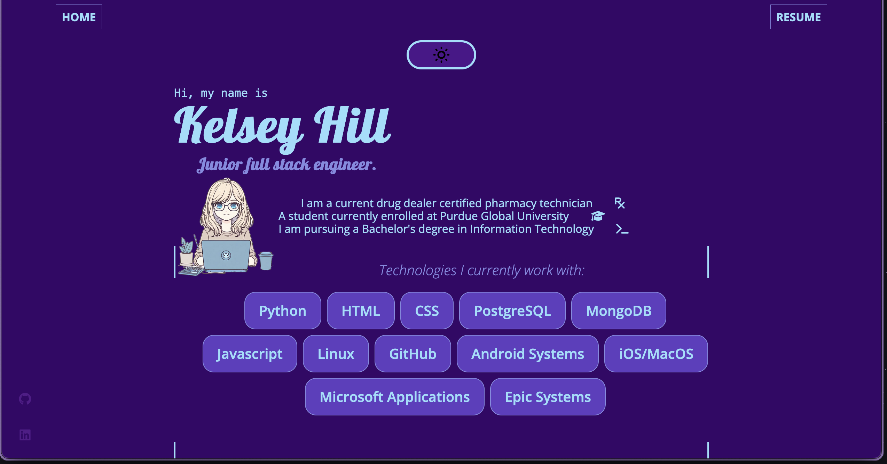

# 🌐 Kelsey Hill's Developer Portfolio

Welcome to my personal portfolio site! I'm Kelsey Hill, a junior full stack engineer and current student at Purdue Global University, pursuing a Bachelor's degree in Information Technology. This site showcases my projects, skills, and personal journey into software development.

🔗 **Live Site**: [kelseykazoo.netlify.app](https://kelseykazoo.netlify.app)

---

## 🛠️ Built With

- HTML5
- CSS3 (with custom variables for light/dark mode)
- JavaScript (vanilla)
- Responsive design using Flexbox & utility classes
- FontAwesome & Google Fonts

---

## 💡 Features

- 🌙 Light/Dark Mode toggle
- 🎓 Education and tech stack overview
- 💻 Project Showcase 
- 📫 Contact section with location, email, and links
- 🔗 Links to GitHub, LinkedIn, and resume

---

## 📷 Preview

 <!-- Optional: Replace with an actual image if available -->

---

## 📁 Folder Structure

```bash
📦 portfolio/
 ┣ 📜 index.html
 ┣ 📜 style.css
 ┣ 📜 normalize.css
 ┣ 📜 script.js
 ┣ 📁 images/
 ┃ ┣ 📜 favicon/
 ┃ ┗ 📜 avatar2.png
 ┗ 📜 README.md
